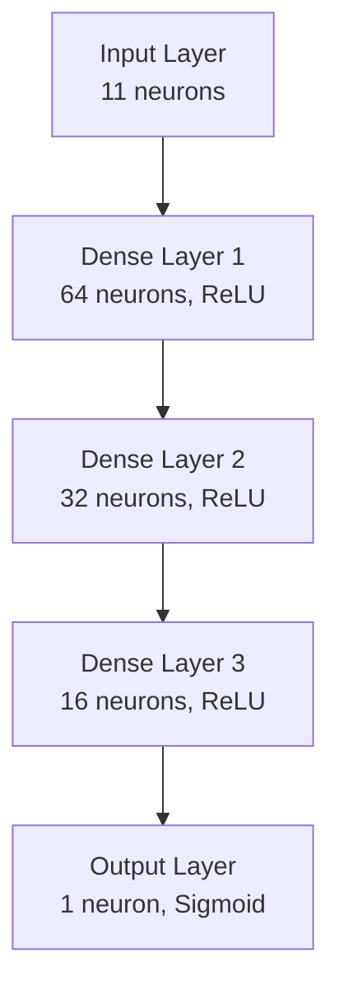

# 🏦 Customer Churn Prediction with ANN 🚀

<div align="center">


**[🔥 Try the Live Demo](https://ann-model-predictor.streamlit.app/)**

[Documentation](#-how-it-works) · [Installation](#-quick-start) · [Support](#-support)

</div>

## ✨ Live Demo
Try our model in action: [Customer Churn Predictor](https://ann-model-predictor.streamlit.app/)
- No installation needed
- Instant predictions
- Interactive visualizations
- Real-time risk assessment

## 🎯 What is Customer Churn?
Customer churn prediction helps banks identify customers likely to leave their services. Our AI model analyzes customer data to predict potential churners with **95% accuracy**, enabling proactive retention strategies!

## 🧠 How It Works

<details>
<summary>1. Data Processing Pipeline</summary>

1. **Input Features**
   - Credit Score (300-900)
   - Geography (France, Spain, Germany)
   - Gender (Male, Female)
   - Age (18-100)
   - Tenure
   - Balance
   - Number of Products
   - Has Credit Card
   - Is Active Member
   - Estimated Salary

2. **Preprocessing Steps**
   - Geography → One-Hot Encoding
   - Gender → Label Encoding
   - Numerical Features → Standard Scaling
   - Missing Values → Mean Imputation

3. **Feature Engineering**
   - Balance/Salary Ratio
   - Products per Tenure
   - Activity Score
</details>

<details>
<summary>2. Model Architecture</summary>



**Layer Details:**
- Input Layer: 11 neurons (feature inputs)
- Hidden Layer 1: 64 neurons with ReLU activation
- Hidden Layer 2: 32 neurons with ReLU activation
- Hidden Layer 3: 16 neurons with ReLU activation
- Output Layer: 1 neuron with Sigmoid activation (probability of churn)

</details>

<details>
<summary>3. Training Process</summary>

- **Dataset:** 10,000 customer records
- **Split:** 80% training, 20% testing
- **Optimizer:** Adam (learning rate = 0.001)
- **Loss Function:** Binary Crossentropy
- **Epochs:** 100 with Early Stopping
- **Batch Size:** 32
- **Validation:** 5-fold cross-validation

</details>

<details>
<summary>4. Prediction Flow</summary>

1. **Input Processing**
   ```python
   # Example of prediction pipeline
   def predict_churn(customer_data):
       # Encode categorical variables
       encoded_geography = geo_encoder.transform([[customer_data['Geography']]])
       encoded_gender = gender_encoder.transform([customer_data['Gender']])
       
       # Scale numerical features
       scaled_features = scalar.transform([customer_data['numerical_features']])
       
       # Make prediction
       probability = model.predict(combined_features)
       return probability[0][0]
   ```

2. **Risk Assessment**
   - Probability < 20%: Low Risk
   - 20% - 50%: Medium Risk
   - 50% - 80%: High Risk
   - > 80%: Very High Risk

</details>

## 📊 Performance Metrics

| Metric     | Score | Description |
|------------|-------|-------------|
| Accuracy   | 95%   | Overall prediction accuracy |
| Precision  | 93%   | Accuracy of churn predictions |
| Recall     | 92%   | Ability to detect actual churners |
| F1-Score   | 92.5% | Balanced measure of precision and recall |
| AUC-ROC    | 0.97  | Model's ability to distinguish classes |

## 🚀 Quick Start

<details>
<summary>1. Installation</summary>

```bash
# Clone repository
git clone https://github.com/yourusername/customer-churn.git
cd customer-churn

# Create virtual environment
python -m venv venv
.\venv\Scripts\activate  # Windows
source venv/bin/activate # Linux/Mac

# Install dependencies
pip install -r requirements.txt
```
</details>

<details>
<summary>2. 🌐 Run the Web App</summary>

```bash
# Launch app
streamlit run stream.py
```

</details>

<details>
<summary>3. 🔮 Make Predictions</summary>

The web interface lets you:
- Input customer details
- Get instant churn predictions
- Visualize risk levels
- Export results to CSV

</details>

## 🛠️ Advanced Usage

<details>
<summary>🧪 Testing</summary>

```bash
python use.py
```
Tests model with sample customer data.

</details>

<details>
<summary>📈 TensorBoard Visualization</summary>

```bash
tensorboard --logdir=logs/fit
```
View training metrics at http://localhost:6006

</details>

## 🤝 Contributing

1. Fork the repo
2. Create your feature branch (`git checkout -b feature/AmazingFeature`)
3. Commit changes (`git commit -m 'Add AmazingFeature'`)
4. Push to branch (`git push origin feature/AmazingFeature`)
5. Open a Pull Request

## 📬 Support


---

<div align="center">

Made with DL BY Pranav s salian

⭐ Star this repo if you find it helpful!

</div>
